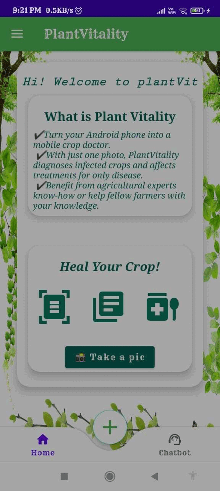

# 🌱 Plant-Vitality – Plant Disease Detection & Fertilizer Recommendation App

**Plant-Vitality** is an intelligent Android application that uses machine learning to detect plant diseases from images and offers personalized care suggestions including fertilizer recommendations. Designed to assist gardeners, farmers, and plant lovers, the app helps users maintain healthy plants using real-time image recognition and an integrated chatbot for instant support.

---

## 🚀 Features

### 🔍 Intelligent Diagnosis
- **Image Recognition** — Detect common plant diseases using your camera or gallery images.
- **ML-Powered Classification** — SVM and CNN models trained to classify various plant diseases.

### 🧠 Smart Assistance
- **Fertilizer Recommendations** — Based on the diagnosed disease, get the best fertilizer suggestions.
- **Chatbot Support** — Ask questions and get care tips instantly with BrainShop AI chatbot.

### 🌿 Care Tips
- Get curated plant care best practices to help your plants thrive.

---

## 🛠 Tech Stack

- **Android Studio** – Development environment  
- **Java / XML** – Application logic and user interface  
- **TensorFlow** – For image recognition and machine learning inference  
- **SVM & CNN Models** – Machine learning algorithms for disease detection  
- **BrainShop API** – For real-time chatbot functionality  

---

## 💡 Use Case

Whether you're a home gardener or an agriculturalist, **Plant-Vitality** simplifies plant care by identifying diseases early and recommending the right solutions — all from your smartphone.

---

## 📚 References

- 🎥 [Gimnath Perera (2021) - Deep Learning based Plant Disease Detection Mobile App](https://www.youtube.com/watch?v=tMptg9HYWo4)  
- 📖 [Irla, T. (2021) - Transfer Learning using Inception-v3 for Image Classification](https://medium.com/analytics-vidhya/transfer-learning-using-inception-v3-for-image-classification-86700411251b)

---

## 🤝 Contributing

Pull requests are welcome! If you have ideas for improvements or additional features, feel free to fork the repo and open a PR.

---

## 📄 License

This project is licensed under the [MIT License](LICENSE).

---

## 🌐 Contact

📧 diwakar.allu.3435@gmail.com  
🔗 [LinkedIn](https://www.linkedin.com/in/alludiwakar3435/)

---
